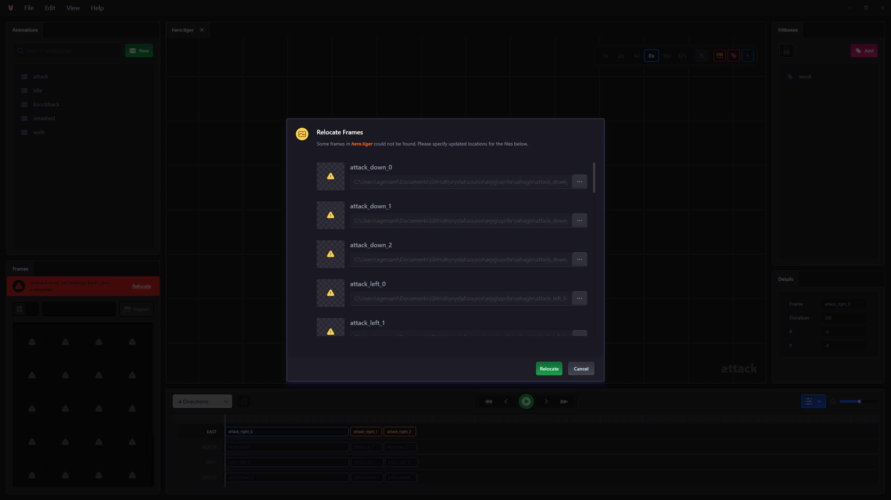

# Tiger File Internals

## Path Storage

`.tiger` spritesheets store file paths pointing at imported frames, and paths referenced in export settings. Because `.tiger` files should be editable by multiple people working on the same game on different computers, all paths are stored relative to the spritesheet file itself. Consider the following file structure:

```
📁 C:\
  📁 my-documents
    📁 cool-game
      📄 hero.tiger
      📁 frames
        🖼 hero-attack.png
        🖼 hero-jump.png
```

In this example, `hero.tiger` stores references to the `.png` files as `frames/hero-attack.png` and `frames/hero-jump.png` - omitting `C:\my-documents\cool-game`.

The downside to this approach is that moving frame files or the sheet itself to a different folder will make these relative paths invalid. When this does happen, Tiger will notify you upon opening `hero.tiger`, and offer a convenient dialog to specify where the frames are now located. This mechanism also works if you move the frames while the sheet is already open in Tiger.



If the sheet itself was moved, export settings are also likely to need adjustments.

## Frame Positions

In `.tiger` files, frame positions are not stored by measuring the delta between keyframe origins and the top-left of the image. Instead, `.tiger` files store the delta between keyframe origins and the _center_ of the image. The benefits of this approach are:

- When adding a new frame to an animation, it is desirable to have it centered on the origin by default. This is simply represented as `(0, 0)` in this model and does not require loading the image from disk to measure it.
- This often minimizes displacement when a frame asset is resized

Regardless of this storage quirk, the recommended way to use `.tiger` files in your game is to go through the [export process](exporting.md).
